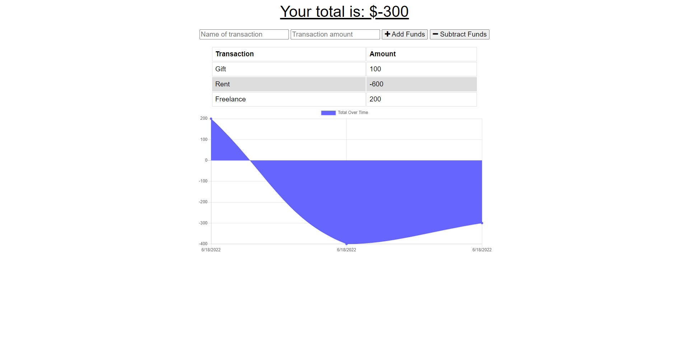

<h1 align="center"> Progressive Web Applications (PWA) Challenge: Budget Tracker </h1>

[](https://bootcamp.msu.edu/)


## Technologies


## Description
Developed an existing budget tracker application to allow for offline access and functionality. The user will be allowed to add expenses and deposits to their budget with or without a connection. If the user enters any transactions while offline, the total should be updated when the application is brought back online.

## Installation
***Requirments***

[Node.js](https://nodejs.org/en/) | [MongoDB](https://www.mongodb.com/) | [Mongoose](https://www.npmjs.com/package/mongoose) | [Express](https://www.npmjs.com/package/express)

***Once Installed:***
1. Clone the Repository on to your machine.
2. Open the terminal and ensure you are in the right file path.
3. Run the command ```npm install``` to download the packages.
4. Then run the command ```node start``` to run the software.
5. The application will then begin to run locally.

## User Story
```
AS AN avid traveler
I WANT to be able to track my withdrawals and deposits with or without a data/internet connection
SO THAT my account balance is accurate when I am traveling
```

## Acceptance Criteria
```
GIVEN a budget tracker without an internet connection
WHEN the user inputs an expense or deposit
THEN they will receive a notification that they have added an expense or deposit
WHEN the user reestablishes an internet connection
THEN the deposits or expenses added while they were offline are added to their transaction history and their totals are updated
```

## Screenshot


## Link
A link to the [code](https://github.com/jgarcia45/budget-tracker):
```
https://github.com/jgarcia45/budget-tracker
```

A link to the [Deployed Application](https://salty-eyrie-96656.herokuapp.com/):
```
https://salty-eyrie-96656.herokuapp.com/
```

## License
Copyright (c) Juan Garcia. All rights reserved.

Licensed under the [MIT](LICENSE) license.